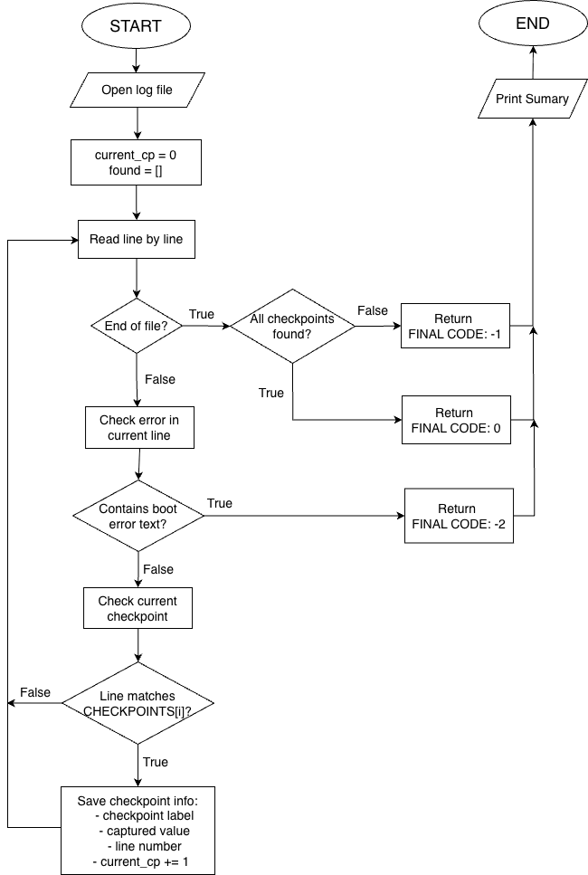

# Ampere SLT Test Intern - OS Boot Monitor

A Python-based boot log monitoring tool that checks whether an operating system boot process passes, fails because of missing checkpoints, or stops immediately when a critical error message appears.

This project was built for the Ampere SLT Test Intern assignment. During OS boot, the console prints messages continuously. The monitor reads those messages, validates required checkpoints in order, and reports the final boot result code.

## Table of Contents

- [Overview](#overview)
- [Problem Statement](#problem-statement)
- [Diagram](#diagram)
- [How It Works](#how-it-works)
- [Project Structure](#project-structure)
- [Requirements](#requirements)
- [Usage](#usage)
- [Result Codes](#result-codes)
- [Required Checkpoints](#required-checkpoints)
- [Error Messages](#error-messages)
- [Output Example](#output-example)
- [Video Demo](#video-demo)
- [Author](#author)

## Overview

`boot_monitor.py` reads a boot log and returns one of three final results:

- `CODE 0`: the boot process passes because all required checkpoints are found in the correct order.
- `CODE -1`: the boot process fails because one or more checkpoints are missing or out of order.
- `CODE -2`: the boot process fails because an error message is detected.

The tool supports two monitoring modes:

- Read and analyze an existing log file, such as `os_bootup.log`.
- Monitor a log file in real time with `--timeout`, which is useful for simulating a log that is still being written.

## Problem Statement

During the OS boot process, the console prints many log lines. A successful boot must include all required checkpoints in the expected order. If any configured error message appears at any point, the monitor must stop immediately and report `CODE -2`.

This project focuses on:

- Reading boot logs line by line.
- Detecting critical error messages as soon as they appear.
- Matching checkpoints with regular expressions.
- Validating checkpoint order.
- Extracting useful boot information such as DRAM version, DDR information, firmware version, Linux version, and kernel version.
- Printing a clear summary with checkpoint status, line numbers, and the final result code.

## Diagram



## How It Works

Main processing flow:

1. The program reads the boot log line by line.
2. Each line is checked for critical error messages first.
3. If an error is found, monitoring stops immediately and returns `CODE -2`.
4. If no error is found, the program checks whether the current expected checkpoint appears.
5. When a checkpoint is matched, the program stores its label, extracted value, and line number.
6. If all checkpoints are found in order, the program returns `CODE 0`.
7. If the log ends before all checkpoints are found, the program returns `CODE -1`.

## Project Structure

```text
.
├── boot_monitor.py                 # Main boot log monitoring script
├── os_bootup.log                   # Sample successful boot log
├── live_boot.log                   # Log file used for real-time monitoring simulation
├── test.log                        # Small test log
├── question.txt                    # Original assignment prompt
├── SLT_Test_Intern.drawio.png      # Project diagram
└── README.md                       # Project documentation
```

## Requirements

- Python 3.x
- No external Python packages are required.

Check your Python version:

```bash
python3 --version
```

## Usage

Run the monitor with the default log file, `os_bootup.log`:

```bash
python3 boot_monitor.py
```

Run the monitor with a specific log file:

```bash
python3 boot_monitor.py live_boot.log
```

Monitor a log file in real time for 20 seconds:

```bash
python3 boot_monitor.py --timeout 20 live_boot.log
```

If your environment uses `python` instead of `python3`, you can run:

```bash
python boot_monitor.py
```

## Result Codes

| Code | Meaning |
| --- | --- |
| `0` | Boot passed. All checkpoints were found in the correct order. |
| `-1` | Boot failed because a checkpoint was missing, out of order, or the input could not be read. |
| `-2` | Boot failed because a critical error message was detected. |

Note: operating systems may wrap negative process exit codes when checking shell exit status. For this reason, the `FINAL CODE` printed in the summary is the value that should be checked.

## Required Checkpoints

The checkpoints must appear in the following order:

1. `Booting Trusted Firmware`
2. `DRAM FW version <dram_version>`
3. `DRAM: <ddr_capacity> DDR5 <ddr_speed> <ddr_ecc> ECC`
4. `DDR init time elapsed: <time>`
5. `Tianocore/EDK2 firmware version <firmware_version>`
6. `Booting Linux on physical CPU`
7. `Fedora Linux <linux_version>`
8. `Kernel <kernel_version>`
9. `login:`

## Error Messages

If any of the following messages appears anywhere in the log, the monitor stops immediately and returns `CODE -2`:

- `Hardware Error`
- `AER failed`
- `PCIe Bus Error`

## Output Example

```text
BOOT MONITOR SUMMARY
  ============================================================
    [OK] CP1: Booting Trusted Firmware  (line 1)
    [OK] CP2: DRAM FW version  [230830-20ebfacc]  (line 8)
    [OK] CP3: DRAM DDR5 info  [768GB DDR5 5600 SYMBOL_64_16]  (line 742)
    [OK] CP4: DDR init time elapsed  [00:03:56]  (line 743)
    [OK] CP5: Tianocore/EDK2 firmware version  [05.04.00005001]  (line 1241)
    [OK] CP6: Booting Linux on physical CPU  (line 1707)
    [OK] CP7: Fedora Linux version  [41]  (line 6943)
    [OK] CP8: Kernel version  [6.12.1-ftk-ac04-64K-rel3+]  (line 6944)
    [OK] CP9: Login prompt  (line 6946)
  ------------------------------------------------------------
    FINAL CODE: 0
```

## Video Demo

To run Terminal 1: 
Get-Content .\os_bootup.log | ForEach-Object { $_ | Out-File -FilePath .\live_test.log -Append; Start-Sleep -Milliseconds 500 } 

To run Terminal 2: 
python boot_monitor.py --log-file live_test.log  

- Google Drive: [OS Boot Monitor Demo](https://drive.google.com/drive/folders/110bf6OBmUf-ztS3WL8h5Uetw636IQ3i7?usp=sharing)

## Author

- Name: Do Thi Nhu Y
- GitHub: [nhuydohihi](https://github.com/nhuydohihi)
- LinkedIn: https://www.linkedin.com/in/nhuydo/
